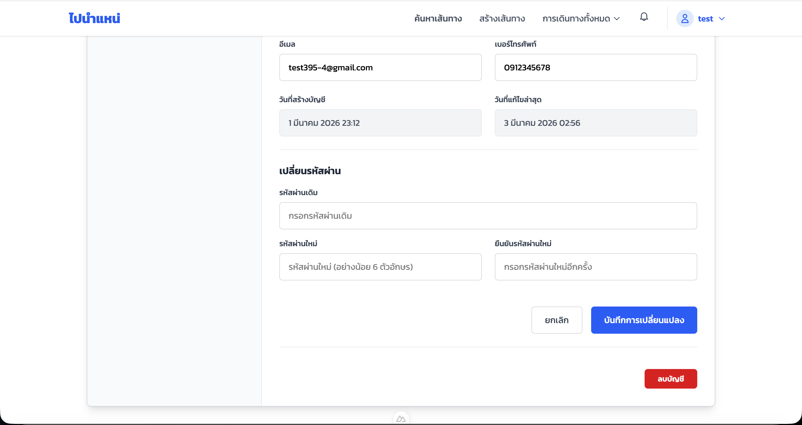
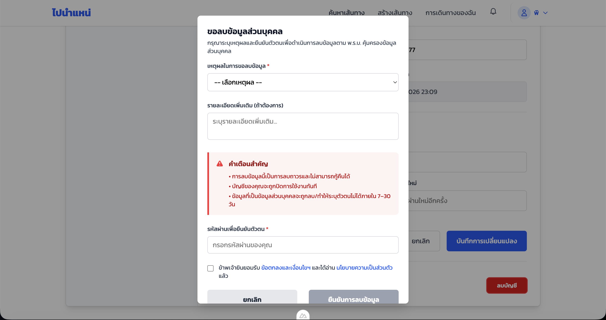
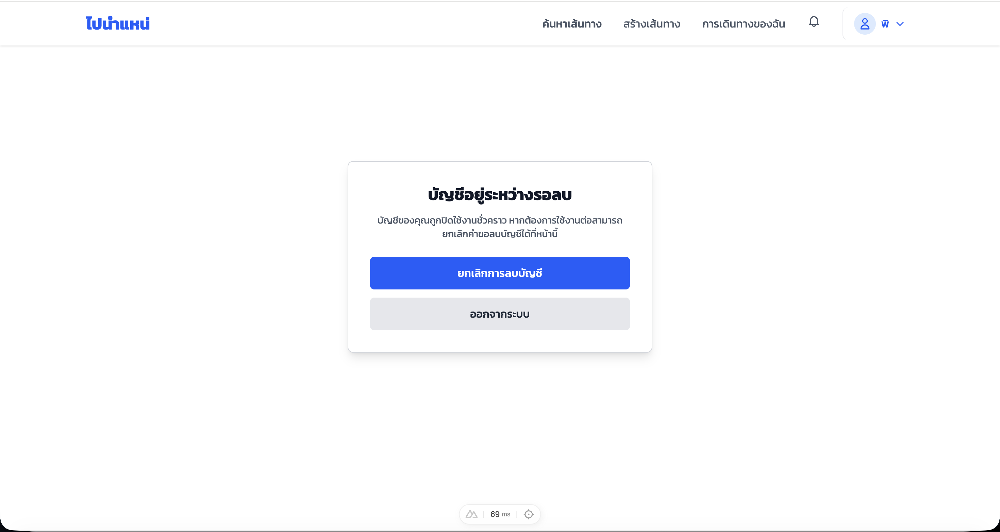
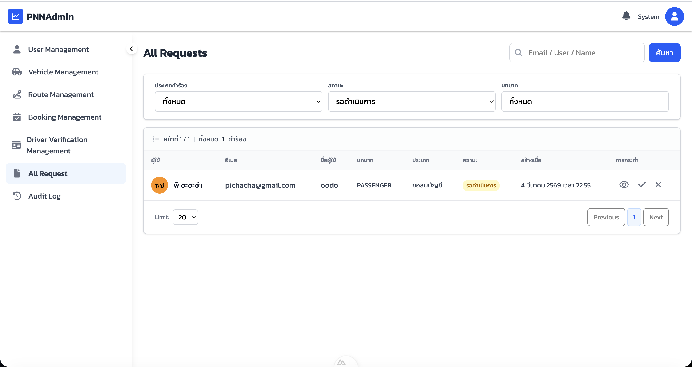
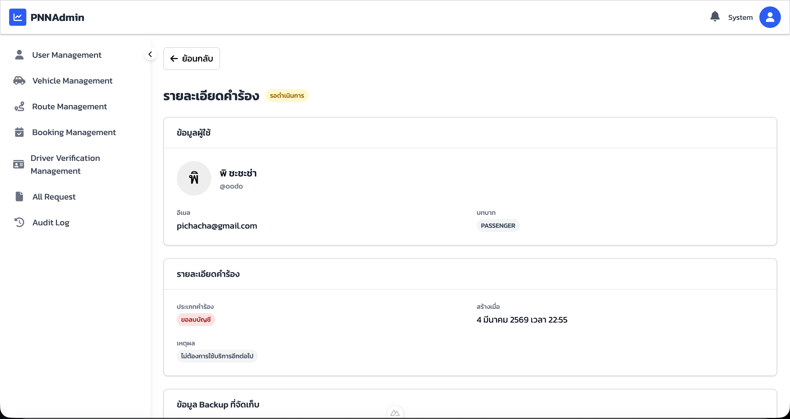
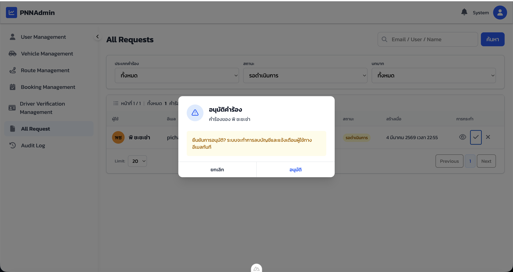
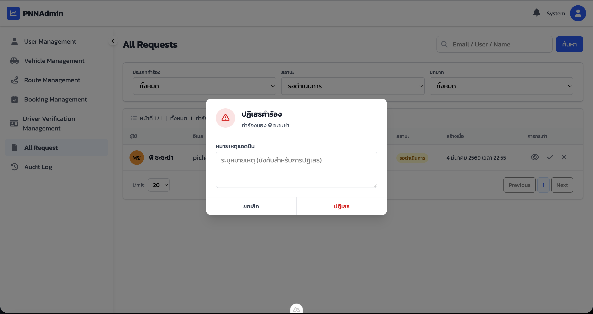
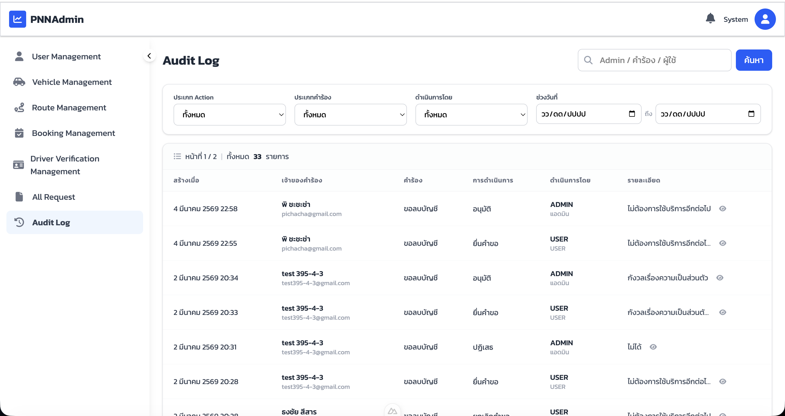

# คู่มือการใช้งาน — ระบบลบบัญชี (PBI-16)

**ระบบ:** ไปนำแหน่
**เวอร์ชัน:** 1.2
**ผู้ใช้งาน:** User (Passenger/Driver), Admin

---

## 0. UI ภาพรวม

ระบบลบบัญชีของไปนำแหน่ประกอบด้วย 3 ส่วนหลัก ได้แก่ ฝั่ง User ที่ขอลบบัญชี ฝั่ง Admin ที่อนุมัติหรือปฏิเสธ และหน้าแจ้งสถานะเมื่อ Login ขณะบัญชีอยู่ระหว่างรอลบ

### 0.1 หน้าโปรไฟล์ — ปุ่มลบบัญชี (User)
ปุ่ม **ลบบัญชี** (สีแดง) อยู่ที่ด้านล่างสุดของหน้าโปรไฟล์

---

### 0.2 ฟอร์มขอลบบัญชี (User)
User ระบุเหตุผล กรอกรหัสผ่านยืนยัน และยอมรับเงื่อนไขก่อนส่งคำขอ

---

### 0.3 หน้า Login — บัญชีอยู่ระหว่างรอลบ (User)
เมื่อ Login ขณะบัญชีอยู่ระหว่างรอลบ ระบบแสดงหน้านี้พร้อมตัวเลือกยกเลิกหรือออกจากระบบ

---

### 0.4 หน้า All Requests (Admin)
Admin เห็นรายการคำขอลบบัญชีทั้งหมด กรองตามสถานะและบทบาทได้

---

### 0.5 หน้ารายละเอียดคำร้อง (Admin)
Admin ดูข้อมูลผู้ใช้ เหตุผล และ Backup ข้อมูลของผู้ขอลบบัญชี

---

### 0.6 Dialog อนุมัติคำร้อง (Admin)
Admin ยืนยันการอนุมัติ ระบบจะแจ้งผู้ใช้ทางอีเมลและเริ่มนับถอยหลังลบข้อมูล

---

### 0.7 Dialog ปฏิเสธคำร้อง (Admin)
Admin ระบุหมายเหตุก่อนกดปฏิเสธคำขอลบบัญชี

---

### 0.8 หน้า Audit Log (Admin)
บันทึกประวัติทุก Event ของการลบบัญชี ตั้งแต่ขอลบ อนุมัติ ปฏิเสธ จนถึงลบสำเร็จ

---

## 1. ขั้นตอนการใช้งาน

---

### ส่วนที่ 1: User ขอลบบัญชี

| ขั้นตอน | การกระทำ |
|---------|---------|
| 1 | เข้าสู่ระบบ แล้วไปที่เมนู **โปรไฟล์** |
| 2 | เลื่อนลงมาด้านล่างสุด กดปุ่ม **ลบบัญชี** (สีแดง) |
| 3 | ฟอร์ม "ขอลบข้อมูลส่วนบุคคล" เปิดขึ้น |
| 4 | เลือก **เหตุผลในการขอลบข้อมูล** จาก dropdown |
| 5 | กรอก **รายละเอียดเพิ่มเติม** (ถ้ามี) |
| 6 | กรอก **รหัสผ่าน** เพื่อยืนยันตัวตน |
| 7 | ติ๊ก checkbox ยืนยันว่าได้อ่านข้อตกลงแล้ว |
| 8 | กดปุ่ม **ยืนยันการลบข้อมูล** |
| 9 | ระบบส่งคำขอไปยัง Admin และ Logout อัตโนมัติ |

> **คำเตือน:** การลบบัญชีไม่สามารถกู้คืนได้ และข้อมูลจะถูกลบภายใน 7–30 วันหลังได้รับการอนุมัติ

---

### ส่วนที่ 2: User ยกเลิกคำขอลบบัญชี

| ขั้นตอน | การกระทำ |
|---------|---------|
| 1 | Login เข้าสู่ระบบ |
| 2 | ระบบแสดงหน้า **"บัญชีอยู่ระหว่างรอลบ"** |
| 3 | กดปุ่ม **ยกเลิกการลบบัญชี** |
| 4 | ระบบยกเลิกคำขอและคืนสิทธิ์การใช้งานปกติ |

---

### ส่วนที่ 3: Admin จัดการคำขอลบบัญชี

#### 3.1 ดูรายการคำขอ

| ขั้นตอน | การกระทำ |
|---------|---------|
| 1 | Login เข้า Admin Panel (PNNAdmin) |
| 2 | เลือกเมนู **All Request** ในแถบด้านซ้าย |
| 3 | กรองรายการด้วย ประเภทคำร้อง / สถานะ / บทบาท ตามต้องการ |
| 4 | กดไอคอน **ดู** (รูปตา) เพื่อดูรายละเอียดคำร้อง |

#### 3.2 อนุมัติคำขอ

| ขั้นตอน | การกระทำ |
|---------|---------|
| 1 | กดไอคอน **ถูก** (✓) ในแถวของผู้ใช้ที่ต้องการอนุมัติ |
| 2 | Dialog "อนุมัติคำร้อง" เปิดขึ้น แสดงชื่อผู้ใช้และคำเตือน |
| 3 | กดปุ่ม **อนุมัติ** |
| 4 | ระบบส่งอีเมลแจ้งผู้ใช้ และเริ่มกระบวนการลบข้อมูลตามกำหนด |

#### 3.3 ปฏิเสธคำขอ

| ขั้นตอน | การกระทำ |
|---------|---------|
| 1 | กดไอคอน **X** ในแถวของผู้ใช้ที่ต้องการปฏิเสธ |
| 2 | Dialog "ปฏิเสธคำร้อง" เปิดขึ้น |
| 3 | กรอก **หมายเหตุ** เพื่อแจ้งเหตุผลแก่ผู้ใช้ |
| 4 | กดปุ่ม **ปฏิเสธ** |
| 5 | ระบบแจ้งผู้ใช้ว่าคำขอถูกปฏิเสธพร้อมเหตุผล |

---

### ส่วนที่ 4: Admin ดู Audit Log

| ขั้นตอน | การกระทำ |
|---------|---------|
| 1 | เลือกเมนู **Audit Log** ในแถบด้านซ้าย |
| 2 | กรองด้วย ประเภท Action / ประเภทคำร้อง / ดำเนินการโดย / ช่วงวันที่ |
| 3 | Audit Log แสดงประวัติทุก Event ได้แก่ ขอลบ, ยืนยัน, อนุมัติ, ปฏิเสธ, ลบสำเร็จ |

---

### สรุปสถานะคำขอลบบัญชี

| สถานะ | ความหมาย |
|-------|---------|
| PENDING | รอ Admin พิจารณา |
| APPROVED | อนุมัติแล้ว รอครบกำหนดลบ |
| REJECTED | ปฏิเสธคำขอ บัญชียังใช้งานได้ปกติ |
| CANCELLED | User ยกเลิกคำขอเอง |
| DELETED | ลบข้อมูลเรียบร้อยแล้ว |

---

## 2. คำชี้แจงการใช้ AI

ทีมพัฒนา PBI-16 มีการใช้เครื่องมือ AI เพื่อสนับสนุนกระบวนการพัฒนาระบบลบบัญชี โดยมีรายละเอียดดังนี้

---

### 2.1 สรุปการใช้ AI ของทีม

| ผู้พัฒนา | AI ที่ใช้ | ระดับการใช้ |
|---------|----------|------------|
| pichamon395-4 | ChatGPT และ Claude | ระดับ 2 |
| Thongchai595-6 | ChatGPT 5.2 | ระดับ 2 |
| Ammika356-3 | ไม่ได้ใช้ | — |
| Bunyasak604-1 | ChatGPT (GPT-5) | ระดับ 2 |
| Kittikorn587-5 | Gemini | ระดับ 2 |
| Jularat387-4 | Gemini | ระดับ 2 |
| Siwawit402-3 | ChatGPT 5.1 | ระดับ 1 |

---

### 2.2 รายละเอียดการใช้ AI แต่ละคน

#### pichamon395-4 — ChatGPT และ Claude (ระดับ 2)

**นำ AI ไปใช้ในด้าน:**
- วิเคราะห์และออกแบบ Database Schema (Prisma) รวมถึง Request System และ Ticket System
- ออกแบบ Audit Log ให้สอดคล้องกับ PDPA และเสนอแนวทาง implementation ให้ถูกต้องตามกฎหมาย
- ตรวจสอบ Prisma schema และวิเคราะห์ Vue UI binding error
- แนะนำการแก้ไข bug โครงสร้างโค้ด และข้อมูลสำหรับแสดงผลหน้า UI
- อธิบายแนวคิด Soft Delete, Audit Logging, Cron Job และ Data Retention Policy
- ปรับปรุงข้อความให้เป็นทางการและถูกต้องทางภาษา รวมถึงแนะนำการตั้งค่า Environment
- วิเคราะห์ปัญหาเกี่ยวกับ Script

**ประโยชน์ที่ได้รับ:**
- ได้รับคำแนะนำทางเทคนิคและช่วยวิเคราะห์โครงสร้างระบบ
- ช่วยตรวจสอบความถูกต้องของ schema และ logic
- ช่วยให้เข้าใจข้อกำหนดทางกฎหมาย (PDPA) ได้ลึกขึ้น
- ช่วยสร้างตัวอย่าง Test Script และโครงสร้าง Test Case ที่ถูกต้องตามมาตรฐาน

---

#### Thongchai595-6 — ChatGPT 5.2 (ระดับ 2)

**นำ AI ไปใช้ในด้าน:**
- ศึกษาค้นคว้าและทำความเข้าใจแนวทางการออกแบบระบบให้สอดคล้องกับกฎหมายคุ้มครองข้อมูลส่วนบุคคล
- ออกแบบโครงสร้างระบบและฐานข้อมูลสำหรับจัดเก็บข้อมูลการตัดสินใจเกี่ยวกับสถานะปัยกรรม
- ตรวจสอบความสมเหตุสมผลของตรรกะการทำงานและข้อผิดพลาดเบื้องต้นของโค้ด

**ประโยชน์ที่ได้รับ:**
- ช่วยอธิบายแนวคิดทางเทคนิคและแนวปฏิบัติที่เหมาะสม
- ให้เสนอแนะเชิงโครงสร้างเพื่อประกอบการออกแบบตามมาตรฐานระบบ
- ช่วยตรวจจานความสมเหตุสมผลของโค้ดและแนวคิดเบื้องต้น

---

#### Ammika356-3 — ไม่ได้ใช้ AI

ผู้พัฒนาท่านนี้ไม่ได้ใช้เครื่องมือ AI ในกระบวนการพัฒนา

---

#### Bunyasak604-1 — ChatGPT (GPT-5) (ระดับ 2)

**นำ AI ไปใช้ในด้าน:**
- จัดทำเอกสารและจัดรูปแบบ Change Log หลังการพัฒนาเสร็จสิ้น

**ประโยชน์ที่ได้รับ:**
- จัดหมวดหมู่ Added / Changed / Fixed ได้ถูกต้อง
- แยกเนื้อหาให้เป็นระบบ ลบข้อความซ้ำและบรรทัดเกิน
- ปรับรูปแบบให้อ่านง่ายและเป็นมาตรฐาน และตรวจสอบความถูกต้องของโครงสร้างเอกสาร

---

#### Kittikorn587-5 — Gemini (ระดับ 2)

**นำ AI ไปใช้ในด้าน:**
- ค้นหาวิธีการส่ง Email แจ้งเตือนไปยัง User
- วิเคราะห์ปัญหาการทำงานของระบบ

**ประโยชน์ที่ได้รับ:**
- ช่วยวิเคราะห์ฟังก์ชัน API และ Database Schema ที่เกี่ยวข้อง
- ช่วยวิเคราะห์ Error log และแนะนำแนวทางแก้ไขบั๊ก
- ให้คำปรึกษาอธิบายการทำงานของระบบ

---

#### Jularat387-4 — Gemini (ระดับ 2)

**นำ AI ไปใช้ในด้าน:**
- หาข้อมูล อธิบายโค้ดเดิมและโค้ดใหม่ และวางโครงสร้าง Docker
- ค้นหาและแก้ไข Bug รวมถึงเขียน README

**ประโยชน์ที่ได้รับ:**
- ได้ข้อมูลเพื่อศึกษาระบบ Docker และออกแบบ Dockerfile
- ช่วยค้นหา Bug และแก้ไขไฟล์ฝั่ง Backend
- หาข้อมูลแนวคิดการวางโครงสร้าง Server และเขียน README ให้สรุปจัดหน้าตาสวยงาม

---

#### Siwawit402-3 — ChatGPT 5.1 (ระดับ 1)

**นำ AI ไปใช้ในด้าน:**
- จัดเตรียมโครงสร้างฐานข้อมูลเบื้องต้น โดยช่วยตรวจสอบความสอดคล้องของตารางและความสัมพันธ์ระหว่างข้อมูล

**ประโยชน์ที่ได้รับ:**
- ช่วยตรวจสอบความสอดคล้องของโครงสร้างข้อมูลในระดับ PDPA
- ลดข้อผิดพลาดเบื้องต้นด้านความสัมพันธ์ข้อมูล
- สนับสนุนให้โครงสร้างฐานข้อมูลสามารถรองรับการทำงานของระบบได้อย่างครบถ้วน

---
