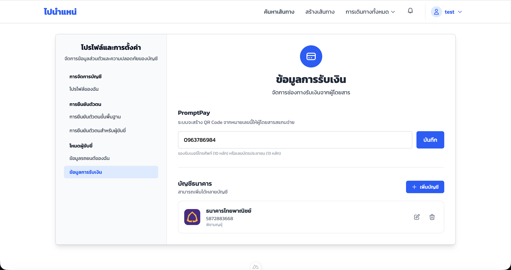

# คู่มือการใช้งาน — ระบบชำระเงิน (PBI-bonus)

**ระบบ:** ไปนำแหน่
**เวอร์ชัน:** 1.2
**ผู้ใช้งาน:** Passenger (ผู้โดยสาร), Driver (คนขับ)

---

## 0. UI ภาพรวม

ระบบชำระเงินของไปนำแหน่รองรับ 3 วิธี ได้แก่ PromptPay, โอนเงินผ่านบัญชีธนาคาร และเงินสด โดย Driver ตั้งค่าข้อมูลรับเงินไว้ล่วงหน้า และ Passenger ชำระเงินหลังเดินทางถึงปลายทาง

---

### 0.1 หน้าข้อมูลการรับเงิน (Driver — Payment Info)
Driver ตั้งค่า PromptPay ID และบัญชีธนาคารสำหรับรับเงิน

---

### 0.2 Modal เลือกวิธีชำระเงิน — Step 1 (Passenger)
Passenger เห็นข้อมูลการชำระเงินและเลือกวิธี: PromptPay, โอนเงิน หรือเงินสด

---

### 0.3 Modal อัปโหลดสลิป — Step 2 (Passenger)
กรณีเลือก PromptPay หรือโอนเงิน Passenger อัปโหลดสลิปการโอน (JPG/PNG/PDF, ขนาดไม่เกิน 10MB)

---

### 0.4 Modal ยืนยันการชำระเงิน — Step 3 (Passenger)
สรุปข้อมูลก่อนยืนยันส่ง

---

### 0.5 QR Code PromptPay (Passenger)
ระบบสร้าง QR Code ตามมาตรฐาน EMV สำหรับสแกนจ่ายตรง

---

### 0.6 สถานะการชำระเงินใน My Trip (Passenger)
แสดงสถานะปัจจุบัน: รอชำระ / รออนุมัติ / ยืนยันแล้ว / ถูกปฏิเสธ

---

### 0.7 Modal ตรวจสอบการชำระเงิน (Driver)
Driver เห็นสลิปและข้อมูลการชำระของ Passenger แต่ละคน พร้อมปุ่มยืนยัน/ปฏิเสธ

---

### 0.8 Dialog ปฏิเสธการชำระเงิน (Driver)
Driver เลือกเหตุผลปฏิเสธสลิป เช่น ยอดเงินไม่ถูกต้อง, รูปภาพไม่ชัดเจน

---

### 0.9 ใบเสร็จรับเงิน (Driver)
Driver ดาวน์โหลดใบเสร็จเป็นรูป PNG หลังการชำระเงินครบทุกคน

---

### 0.10 หน้าตั้งค่าบัญชีธนาคาร (Driver)
Driver เพิ่ม/แก้ไขบัญชีธนาคารหลายบัญชีได้

---

### 0.11 สถานะหลังถูกปฏิเสธ (Passenger)
แสดงเหตุผลที่ถูกปฏิเสธและปุ่มส่งสลิปใหม่

---

### 0.12 หน้าจัดการ Booking (Admin)
Admin ดูรายละเอียด Booking และสถานะการชำระเงินของผู้โดยสารแต่ละคน

---

## 1. ขั้นตอนการใช้งาน

---

### กรณีที่ 1: Driver ตั้งค่าข้อมูลรับเงิน

| ขั้นตอน | การกระทำ |
|---------|---------|
| 1 | Login เข้าสู่ระบบในฐานะ Driver |
| 2 | ไปที่เมนู **โปรไฟล์** → **ข้อมูลการรับเงิน** |
| 3 | กรอก **PromptPay ID** (เบอร์มือถือหรือเลขบัตรประชาชน) |
| 4 | กดปุ่ม **เพิ่มบัญชีธนาคาร** เลือกธนาคาร กรอกเลขบัญชีและชื่อบัญชี |
| 5 | กดปุ่ม **บันทึก** |

> **หมายเหตุ:** ข้อมูลนี้จะแสดงให้ Passenger เห็นเมื่อถึงเวลาชำระเงิน

---

### กรณีที่ 2: Passenger ชำระเงินด้วย PromptPay / โอนเงิน

| ขั้นตอน | การกระทำ |
|---------|---------|
| 1 | Driver กดปุ่ม **ถึงที่หมายแล้ว** ในหน้า My Route |
| 2 | Passenger ได้รับ Notification และเข้า **My Trip** |
| 3 | กดปุ่ม **ชำระเงิน** — Modal Step 1 เปิดขึ้น แสดงยอดและ QR Code / เลขบัญชี |
| 4 | เลือกวิธีชำระ: **PromptPay** หรือ **โอนเงิน** |
| 5 | โอนเงิน แล้วกด **ถัดไป** — Modal Step 2 เปิดขึ้น |
| 6 | อัปโหลดสลิป (JPG/PNG/PDF ≤ 10MB) กด **ถัดไป** |
| 7 | Modal Step 3: ตรวจสอบข้อมูล กด **ยืนยันการชำระเงิน** |
| 8 | สถานะเปลี่ยนเป็น **รออนุมัติ** |

---

### กรณีที่ 3: Passenger ชำระเงินด้วยเงินสด

| ขั้นตอน | การกระทำ |
|---------|---------|
| 1 | Driver กดปุ่ม **ถึงที่หมายแล้ว** |
| 2 | Passenger เข้า **My Trip** กดปุ่ม **ชำระเงิน** |
| 3 | เลือกวิธีชำระ: **เงินสด** กด **ถัดไป** |
| 4 | Modal Step 3: ยืนยันการจ่ายเงินสดต่อ Driver โดยตรง กด **ยืนยัน** |
| 5 | สถานะเปลี่ยนเป็น **รออนุมัติ** (Driver ต้องกดยืนยันรับเงินสด) |

---

### กรณีที่ 4: Driver ตรวจสอบและยืนยันการชำระเงิน

| ขั้นตอน | การกระทำ |
|---------|---------|
| 1 | Driver ได้รับ Notification เมื่อ Passenger ส่งสลิป |
| 2 | กดปุ่ม **ตรวจสอบการชำระเงิน** ใน My Route |
| 3 | Modal แสดงรายการ Passenger พร้อมสลิป |
| 4 | ตรวจสอบยอดเงิน ชื่อผู้โอน และวันเวลา |
| 5 | กดปุ่ม **ยืนยัน** — สถานะเปลี่ยนเป็น **ยืนยันแล้ว** |

---

### กรณีที่ 5: Driver ปฏิเสธการชำระเงิน

| ขั้นตอน | การกระทำ |
|---------|---------|
| 1 | ใน Modal ตรวจสอบ กดปุ่ม **ปฏิเสธ** |
| 2 | เลือก **เหตุผล** เช่น ยอดเงินไม่ถูกต้อง / รูปภาพไม่ชัดเจน / สลิปเก่า |
| 3 | กดปุ่ม **ยืนยันการปฏิเสธ** |
| 4 | ระบบแจ้ง Passenger พร้อมเหตุผล สถานะเปลี่ยนเป็น **ถูกปฏิเสธ** |

---

### กรณีที่ 6: Passenger ส่งสลิปใหม่หลังถูกปฏิเสธ

| ขั้นตอน | การกระทำ |
|---------|---------|
| 1 | Passenger ได้รับ Notification ว่าสลิปถูกปฏิเสธ |
| 2 | เข้า **My Trip** — เห็นสถานะ **ถูกปฏิเสธ** พร้อมเหตุผล |
| 3 | กดปุ่ม **ส่งสลิปใหม่** |
| 4 | อัปโหลดสลิปใหม่ที่ถูกต้อง กด **ยืนยัน** |
| 5 | สถานะกลับเป็น **รออนุมัติ** |

---

### สรุปสถานะการชำระเงิน

| สถานะ | ความหมาย |
|-------|---------|
| PENDING | รอ Passenger ชำระเงิน |
| SUBMITTED | Passenger ส่งสลิปแล้ว รอ Driver ตรวจสอบ |
| VERIFIED | Driver ยืนยันแล้ว การชำระเงินสมบูรณ์ |
| REJECTED | Driver ปฏิเสธสลิป รอ Passenger ส่งใหม่ |

---

## 2. คำชี้แจงการใช้ AI

ทีมพัฒนา PBI-bonus มีการใช้เครื่องมือ AI เพื่อสนับสนุนกระบวนการพัฒนาระบบชำระเงิน โดยมีรายละเอียดดังนี้

---

### 2.1 สรุปการใช้ AI ของทีม

| ผู้พัฒนา | AI ที่ใช้ | ระดับการใช้ |
|---------|----------|------------|
| pichamon395-4 | ChatGPT และ Claude | ระดับ 2 |
| Thongchai595-6 | ChatGPT 5.2 | ระดับ 2 |
| Ammika356-3 | ไม่ได้ใช้ | — |
| Bunyasak604-1 | ChatGPT (GPT-5) | ระดับ 2 |
| Kittikorn587-5 | Gemini | ระดับ 2 |
| Jularat387-4 | Gemini | ระดับ 2 |
| Siwawit402-3 | ChatGPT 5.1 | ระดับ 1 |

---

### 2.2 รายละเอียดการใช้ AI แต่ละคน

#### pichamon395-4 — ChatGPT และ Claude (ระดับ 2)

**นำ AI ไปใช้ในด้าน:**
- ออกแบบ Payment flow และ State Machine (PENDING → SUBMITTED → VERIFIED/REJECTED)
- วิเคราะห์ Prisma Schema สำหรับ Payment, BankAccount และ Notification model
- ศึกษาและ implement มาตรฐาน EMV QR Code สำหรับ PromptPay
- แก้ไข Bug ใน Vue component เช่น Modal binding และ Cloudinary integration
- ออกแบบ UI/UX ของ PaymentSlipModal และ DriverPaymentModal

**ประโยชน์ที่ได้รับ:**
- ช่วยออกแบบ flow ที่ครอบคลุมทุก edge case
- ช่วยทำความเข้าใจมาตรฐาน EMV และ PromptPay QR
- ช่วยวิเคราะห์โครงสร้าง component และแนะนำการแก้ไข

---

#### Thongchai595-6 — ChatGPT 5.2 (ระดับ 2)

**นำ AI ไปใช้ในด้าน:**
- ศึกษาแนวทางการ integrate Payment Slip Modal กับหน้า My Trip
- วิเคราะห์การทำงานของ API endpoint สำหรับส่งสลิปและตรวจสอบสถานะ
- ตรวจสอบ logic การแสดงผลสถานะการชำระเงินในฝั่ง Frontend

**ประโยชน์ที่ได้รับ:**
- ช่วยทำความเข้าใจการเชื่อมต่อ Frontend กับ Backend
- ช่วยวิเคราะห์ Error ที่เกิดจาก API response format
- แนะนำแนวทาง implement UI component ที่ถูกต้อง

---

#### Ammika356-3 — ไม่ได้ใช้ AI

ผู้พัฒนาท่านนี้ไม่ได้ใช้เครื่องมือ AI ในกระบวนการพัฒนา

---

#### Bunyasak604-1 — ChatGPT (GPT-5) (ระดับ 2)

**นำ AI ไปใช้ในด้าน:**
- จัดทำเอกสาร User Manual และ Changelog ของระบบชำระเงิน
- สรุปขั้นตอนการทำงานของระบบให้เข้าใจง่าย

**ประโยชน์ที่ได้รับ:**
- ช่วยจัดรูปแบบเอกสารให้เป็นมาตรฐาน
- ช่วยสรุปขั้นตอนและอธิบาย flow ให้ครบถ้วน

---

#### Kittikorn587-5 — Gemini (ระดับ 2)

**นำ AI ไปใช้ในด้าน:**
- วิเคราะห์ระบบส่ง Email Notification เมื่อสถานะการชำระเงินเปลี่ยน
- ศึกษาการ configure SMTP สำหรับ Payment notification

**ประโยชน์ที่ได้รับ:**
- ช่วยแก้ปัญหา SMTP configuration และ Email delivery
- ช่วยวิเคราะห์โครงสร้าง Notification service

---

#### Jularat387-4 — Gemini (ระดับ 2)

**นำ AI ไปใช้ในด้าน:**
- ออกแบบและ implement Payment Methods API (REST endpoint)
- วิเคราะห์ Prisma Schema เพิ่มเติมสำหรับ BankAccount model

**ประโยชน์ที่ได้รับ:**
- ช่วยออกแบบ API structure ที่ถูกต้องตามมาตรฐาน REST
- ช่วยตรวจสอบ Schema relationship ระหว่าง User และ BankAccount

---

#### Siwawit402-3 — ChatGPT 5.1 (ระดับ 1)

**นำ AI ไปใช้ในด้าน:**
- ศึกษาแนวทางการทดสอบระบบชำระเงินเบื้องต้น

**ประโยชน์ที่ได้รับ:**
- ช่วยอธิบายแนวคิดการทดสอบ Payment flow
- ช่วยตรวจสอบความครบถ้วนของ Test Case

---
